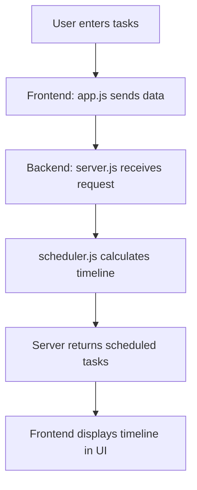

# 📝 Auto To-Do Scheduler

A simple **full-stack web app** that takes a list of tasks and automatically schedules them into a timeline with optional breaks (wait times).  
Built with **Express.js** (backend) and **Vanilla JS + HTML/CSS** (frontend).

---

## 🚀 Features
- Input tasks with optional durations (`Task name | minutes`)
- Default task duration = **30 minutes** (if not specified)
- Automatic scheduling from a configurable **start time**
- Configurable **wait time (break)** between tasks
- Clean, responsive dark-mode UI

---

## 📂 Project Structure
```
auto-todo-app/
│
├── backend/
│   ├── server.js       # Express API & static file server
│   └── scheduler.js    # Scheduling logic
│
├── frontend/
│   ├── index.html      # Main UI
│   ├── app.js          # Frontend logic (fetch API)
│   └── styles.css      # Styling (dark theme)
│
├── package.json
└── README.md
```

---

## ⚡ Installation & Setup

1. **Clone the repository**
   ```bash
   git clone https://github.com/your-username/auto-todo-app.git
   cd auto-todo-app
   ```

2. **Install dependencies**
   ```bash
   npm install
   ```

3. **Run the backend server**
   ```bash
   node backend/server.js
   ```
   Server will start at [http://localhost:3000](http://localhost:3000)

4. **Open the app**  
   Visit [http://localhost:3000](http://localhost:3000) in your browser.  
   Enter tasks into the form, one per line.  

---

## 🖊️ Usage Example

**Input in the textarea**
```
Task A | 45
Task B | 30
Task C
```

**Output schedule**
```
Task A: 08:00 - 08:45
Task B: 08:50 - 09:20
Task C: 09:25 - 09:55
```
*(includes 5-minute break between tasks)*

---

## 🎨 Screenshots
- Input Form  
- Scheduled Tasks Result  

*(replace these placeholders with real screenshots from your running app for GitHub)*

---

## ⚙️ Configuration

- **Default start time:** 08:00  
- **Default task duration:** 30 minutes  
- **Default wait time:** 5 minutes  

You can change these defaults in `backend/scheduler.js`.  

Example:
```js
autoScheduleTasks(tasks, "09:00", 10); // Start at 9 AM, 10 min break between tasks
```

---

## 📜 License
This project is licensed under the **ISC License**.  
Feel free to modify and use it for your own purposes.

---

## 🔄 How It Works (Workflow)



---
✨ This README is **complete and ready for GitHub**.
